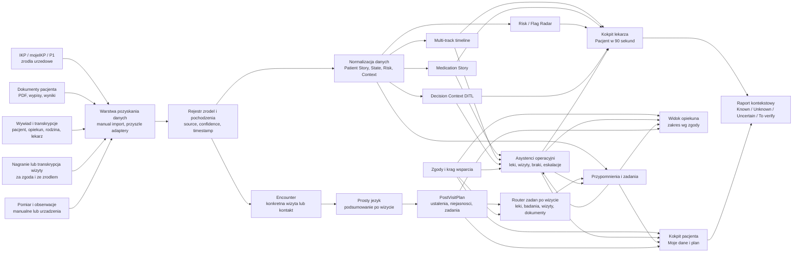

# Pacjent360™ - architektura systemu

Wersja: `0.2`

Cel: zaprojektowac Pacjent360™ jako otwarta warstwe kontekstu pacjenta nad istniejacym ekosystemem e-zdrowia, w szczegolnosci IKP/P1, bez zastapienia IKP i bez obchodzenia oficjalnych mechanizmow dostepu.

Dokument nadrzedny dla LLM i asystentow operacyjnych: `SSOT.md`. Jesli opis agentow, zakresow lub outputow w architekturze koliduje z `SSOT.md`, obowiazuje `SSOT.md` do czasu formalnej aktualizacji ADR.

## Teza architektoniczna

Pacjent360™ nie powinien byc aplikacja, ktora "udaje pacjenta" i loguje sie do IKP za niego. Powinien byc:

> warstwa porzadkowania, wspolpracy i kontekstu decyzyjnego nad danymi pacjenta.

IKP/P1 pozostaje zrodlem urzedowym dla e-recept, e-skierowan, EDM i zdarzen medycznych. Pacjent360™ dodaje warstwe, ktorej w praktyce klinicznej czesto brakuje: wywiad, os czasu, leki faktycznie przyjmowane, pytania do lekarza, braki danych, przypomnienia, zgody rodzinne i raport "co trzeba wyjasnic przed decyzja".

Druga teza produktu: Pacjent360™ powinien obejmowac cala petle wizyty, nie tylko przygotowanie raportu przed kontaktem medycznym.

```text
Przed wizyta -> w trakcie wizyty -> po wizycie
historia i pytania -> transkrypcja i zrodla -> prosty jezyk, ustalenia, zadania i kontrola zgody
```

Po wizycie system moze pomoc pacjentowi i opiekunowi zrozumiec, co padlo w rozmowie, zapisac ustalenia jako elementy do potwierdzenia, utworzyc zadania organizacyjne i pilnowac, z czego wynikaja. Nie moze jednak zmieniac sensu wypowiedzi lekarza, dodawac interpretacji klinicznej ani wykonywac decyzji medycznych.

## Zasady

1. Pacjent kontroluje dostep.
2. IKP/P1 pozostaje zrodlem urzedowym.
3. Pacjent360™ nie przechowuje loginow ani hasel do IKP.
4. Kazda informacja ma zrodlo, typ zrodla i poziom pewnosci.
5. Kazda decyzja kliniczna pozostaje DITL: Doctor in the Loop. Lekarz decyduje, system pyta i porzadkuje.
6. Przypomnienia nie sa zaleceniami terapeutycznymi. Sa odtworzeniem planu z dokumentu, recepty, wizyty albo wpisu pacjenta oznaczonego jako "do potwierdzenia".
7. Dostep opiekuna/rodziny jest granularny, czasowy, odwolalny i audytowany.
8. Domyslnie prywatnosc: minimum danych, minimum uprawnien, jawny audyt.
9. Automatyzacja asystentow operacyjnych jest logistyczna, nie kliniczna: asystent moze przypomniec, sprawdzic komplet, wykryc brak i poprosic o potwierdzenie, ale nie moze zmienic leczenia ani wydac zalecenia terapeutycznego.
10. Podsumowanie po wizycie jest materialem pomocniczym dla pacjenta, nie dokumentacja medyczna i nie interpretacja kliniczna.
11. Nagranie lub transkrypcja wizyty wymaga jawnego zrodla, zgody, retencji i mozliwosci usuniecia.
12. Zadania po wizycie sa organizacyjne: sprawdzic dokument, potwierdzic dawke w zrodle, umowic badanie, znalezc placowke, przygotowac pytanie. Nie sa zaleceniami medycznymi.

## Widok systemowy



## Granice odpowiedzialnosci

| Obszar | IKP/P1 | Pacjent360™ |
| --- | --- | --- |
| e-recepta, e-skierowanie, EDM | Zrodlo urzedowe | Odczyt/import jako zrodlo kontekstu, jesli legalnie dostepne |
| Dokumentacja dodana przez pacjenta | Nie zawsze kompletna | Przechowywanie, opis, zrodlo, os czasu |
| Wywiad | Poza standardowym IKP | Strukturalny wywiad i transkrypcja z oznaczeniem rozmowcy |
| Leki faktycznie brane | Czesto niepelne | Medication Story: przepisane vs faktycznie przyjmowane |
| Opiekun/rodzina | Upowaznienia w IKP/mojeIKP | Krag wsparcia, zakresy, przypomnienia, obserwacje, audyt |
| Decyzja kliniczna | Lekarz/system placowki | Pytania, flagi, braki danych, raport DITL |
| Zalecenia terapeutyczne | Lekarz | Brak automatycznych zalecen |
| Transkrypcja wizyty | Rozmowa lekarz-pacjent, dokumentacja placowki jesli istnieje | Zrodlo pomocnicze za zgoda, do podsumowania prostym jezykiem i zadan do potwierdzenia |
| Ustalenia po wizycie | Lekarz i dokumentacja medyczna pozostaja zrodlem rozstrzygajacym | `PostVisitPlan` jako draft pacjenta/opiekuna z linkiem do zrodla i statusem `do potwierdzenia` |
| Zakup lub odbior leku | e-recepta, farmaceuta, apteka | Zadanie organizacyjne: sprawdzic e-recepte, dostepnosc lub odbior; brak zamiennikow i brak rekomendacji terapii |
| Badanie lub skierowanie | Lekarz, e-skierowanie, placowka | Zadanie organizacyjne: umowic, wykonac, dostarczyc wynik; brak oceny pilnosci |
| Wyszukanie specjalisty lub terminu | Pacjent wybiera placowke i termin | Pomoc w checklistach i linkach do zrodel; brak decyzji, czy dana specjalizacja jest klinicznie wlasciwa |

## Warstwy architektury

### 1. Warstwa pozyskania danych

MVP:

- reczne dodawanie dokumentow i wpisow,
- reczne wklejenie transkrypcji wywiadu,
- reczne wklejenie transkrypcji wizyty albo notatki pacjenta po wizycie,
- reczne dodanie lekow, wizyt, wynikow i wydarzen,
- eksport/import JSON.

Wersja kolejna:

- import plikow PDF/JPG z lokalnym OCR,
- lokalne oznaczanie fragmentow transkrypcji jako wypowiedz lekarza, pacjenta, opiekuna albo osoby trzeciej,
- parser wynikow badan jako dane "do potwierdzenia",
- import z plikow pacjenta lub eksportow placowek,
- mechanizm mapowania do wspolnego modelu `timelineEvents`, `medications`, `documents`, `decisionContexts`, `encounters`, `postVisitPlans`, `careTasks`.

Wersja docelowa:

- oficjalny adapter P1/CEZ, jesli projekt uzyska prawny i techniczny dostep,
- adapter dla systemu placowki medycznej,
- adapter standardow interoperacyjnosci, np. HL7 CDA/FHIR tam, gdzie jest to dostepne i zgodne z dokumentacja integracyjna.

Zakaz architektoniczny:

- brak scrapingu IKP,
- brak przechowywania danych logowania do IKP,
- brak automatycznego podszywania sie pod pacjenta.
- brak live recording w MVP,
- brak wysylania nagran lub transkrypcji z realnymi danymi do zewnetrznych modeli LLM bez osobnej podstawy prawnej, DPIA i review security/privacy.

### 2. Warstwa pochodzenia danych

Kazdy rekord musi miec:

- `sourceId`,
- typ zrodla: `ikp`, `p1`, `document`, `interview`, `transcript`, `visit_transcript`, `visit_recording`, `post_visit_note`, `patient_entry`, `caregiver_entry`, `doctor_entry`, `lab_result`, `prescription`, `referral`, `system`,
- date pozyskania,
- date zdarzenia,
- poziom pewnosci,
- osobe lub system, ktory dodal dane,
- link do zrodla w UI.

To jest krytyczne, bo lekarz musi wiedziec, czy widzi wynik laboratoryjny, relacje pacjenta, obserwacje opiekuna czy tekst z dokumentu.

### 3. Warstwa modelu domenowego

Minimalny model docelowy:

```text
Patient
PatientProfile
Source
Document
Interview
Transcript
Encounter
VisitArtifact
VisitSummary
PostVisitPlan
TimelineEvent
MedicationOrder
MedicationIntakePlan
MedicationActualUse
MedicationSourceTask
VisitReminder
CareTask
CareTaskExecution
AgentDefinition
AgentTask
AgentRun
AgentPolicy
Escalation
DecisionContext
Flag
KnownUnknown
ConsentGrant
SupportPerson
AccessScope
AuditLog
Report
```

Najwazniejsze relacje:

- `Document` moze tworzyc wiele `TimelineEvent`.
- `Interview` moze tworzyc wiele obserwacji, ale oznaczonych jako wywiad.
- `Encounter` reprezentuje konkretna wizyte, teleporade, konsultacje lub kontakt medyczny.
- `VisitArtifact` reprezentuje material z wizyty: transkrypcje, notatke pacjenta, notatke opiekuna albo link do dokumentu.
- `VisitSummary` jest podsumowaniem prostym jezykiem, zawsze jako draft do akceptacji.
- `PostVisitPlan` grupuje ustalenia po wizycie, elementy niejasne, pytania DITL i zadania organizacyjne.
- `CareTask` opisuje krok do wykonania po wizycie, np. potwierdzic dokument, sprawdzic e-recepte, umowic badanie, znalezc termin, przygotowac pytanie.
- `MedicationOrder` opisuje lek przepisany.
- `MedicationActualUse` opisuje lek realnie przyjmowany.
- `MedicationSourceTask` przypomina o sprawdzeniu źródła zadania lekowego, ale nie zmienia dawki i nie interpretuje terapii.
- `AgentTask` opisuje zadanie operacyjne asystenta, np. przypomnienie, sprawdzenie kompletu dokumentow albo eskalacje pytania do lekarza.
- `AgentPolicy` okresla, czego asystentowi wolno i czego nie wolno zrobic dla danej roli, pacjenta i zakresu zgody.
- `AgentRun` zapisuje kazde uruchomienie asystenta, wynik, zrodla i ewentualna eskalacje.
- `DecisionContext` grupuje pytanie kliniczne, luki, flagi i status DITL.
- `ConsentGrant` okresla, kto i w jakim zakresie widzi dane pacjenta.
- `AuditLog` zapisuje kazdy dostep, eksport i zmiane zgody.

### 4. Warstwa kontekstu klinicznego

Moduly:

- `Patient Story`: historia pacjenta z dokumentow, wywiadow i obserwacji.
- `Patient State`: obecny stan, funkcjonowanie, aktywne problemy, ostatnia zmiana.
- `Patient Risk`: flagi red, amber, green i blue.
- `Decision Context`: pytania DITL do lekarza.
- `Medication Story`: zgodnosc lekow przepisanych i faktycznie branych.
- `Known / Unknown / Uncertain / To verify`: format raportu.

Regula bezpieczenstwa:

```text
System moze powiedziec: "Czy aktualna lista lekow zostala potwierdzona?"
System nie moze powiedziec: "Odstaw lek X" albo "Zastosuj leczenie Y".
```

### 5. Warstwa zgody i kregu wsparcia

Pacjent moze zaprosic osobe wspierajaca, ale nadaje jej tylko konkretny zakres:

```text
SupportPerson
- name
- relation: caregiver | family | trusted_person | clinician
- status: invited | active | expired | revoked
- scopes:
  - view_medications
  - view_visits
  - view_documents
  - view_results
  - add_observation
  - confirm_reminder
  - export_report
- validFrom
- validTo
- createdByPatient
- revokedAt
```

Role produktowe:

- `Rodzic / opiekun prawny / osoba wspierajaca`: czlowiek w kregu opieki z relacja do pacjenta i zakresem dostepu wynikajacym ze zgody. Czlowiek z dostepem do obszaru lekow widzi plan lekow i moze oznaczac zadania jako wykonane; czlowiek z dostepem do obszaru wizyt widzi terminy, checklisty i dokumenty wymagane na wizyte.
- `Asystent lekow / asystent wizyt`: funkcje systemu, nie osoby i nie role ludzi. Asystent lekow pomaga uporzadkowac harmonogram, braki potwierdzenia i rozbieznosci miedzy lekiem przepisanym a faktycznie przyjmowanym; asystent wizyt pilnuje kompletu dokumentow, pytan do lekarza i zadan przed kontaktem medycznym. Decyzja zawsze nalezy do czlowieka.
- `Rodzina / osoba wspierajaca`: widzi wybrane dane i moze dodac obserwacje (oznaczone jako obserwacje, nie fakty kliniczne).
- `Lekarz`: widzi raport i zrodla podczas kontaktu medycznego.
- `Pacjent`: wlasciciel zgody, zakresu i odwolania dostepu.

Kazda akcja osoby wspierajacej tworzy wpis w audycie.

Asystent dziala tylko w zakresie zgody pacjenta. Jesli pacjent dal opiekunowi dostep tylko do wizyt, asystent wizyt nie ma prawa analizowac lekow ani wynikow badan. Jesli pacjent cofa zgode, asystent traci dostep i tworzy wpis w audycie.

### 6. Warstwa zadan i przypomnien organizacyjnych

Zadania zwiazane z lekami musza miec zrodlo i nie moga zmieniac dawki ani interpretowac terapii:

```text
MedicationSourceTask
- medicationId
- sourceId
- dueAt
- taskStatus
- createdBy
- assignedTo
- status: planned | reminded | taken | skipped | needs_verification
- confirmationBy
- confirmationAt
```

Zasady:

- przypomnienie jest informacyjne,
- harmonogram pochodzi z recepty, dokumentu, wpisu lekarza lub wpisu pacjenta,
- jesli pochodzi od pacjenta/opiekuna, ma status `needs_verification`,
- system nie modyfikuje dawkowania,
- system moze pokazac pytanie: "Czy ten harmonogram zostal potwierdzony z lekarzem?"

### 7. Warstwa After Visit Loop

Cel tej warstwy: zamienic material z wizyty w zrozumiale podsumowanie, liste niejasnosci i zadania organizacyjne, bez interpretacji klinicznej.

Minimalny przeplyw:

```text
Encounter
-> VisitArtifact
-> VisitPlainLanguageAgent
-> VisitSummary draft
-> PostVisitTaskRouter
-> CareTask[]
-> ConsentGuardAgent
-> widok pacjenta / opiekuna / lekarza
```

Kontrakt `Encounter`:

```text
Encounter
- id
- patientId
- occurredAt
- encounterType: in_person | teleconsultation | hospital | procedure | other
- providerLabel
- specialtyLabel
- sourceRefs
- status: planned | completed | cancelled | needs_confirmation
```

Kontrakt `VisitArtifact`:

```text
VisitArtifact
- id
- encounterId
- type: transcript | audio_reference | patient_note | caregiver_note | doctor_document
- sourceId
- speakerMap
- consentStatus: confirmed | missing | withdrawn | not_applicable
- confidenceLabel: high | medium | low
- retentionPolicy
```

Kontrakt `VisitSummary`:

```text
VisitSummary
- id
- encounterId
- sourceRefs
- plainLanguageSummary
- statedByDoctor
- statedByPatient
- statedByCaregiver
- unclearItems
- ditlQuestions
- status: draft | needs_review | accepted | rejected | superseded
- acceptedBy
- acceptedAt
```

Kontrakt `PostVisitPlan`:

```text
PostVisitPlan
- id
- encounterId
- summaryId
- careTaskIds
- medicationRefs
- referralRefs
- labOrderRefs
- documentRefs
- nextContactContext
- status: draft | needs_review | active | closed | superseded
```

Kontrakt `CareTask`:

```text
CareTask
- id
- type: medication_purchase | medication_confirmation | lab_test_to_schedule | lab_result_to_deliver | referral_booking | appointment_booking | document_upload | question_to_confirm | caregiver_followup | data_check
- title
- description
- ownerRole: patient | caregiver | doctor | pharmacist | project_reviewer
- sourceRefs
- consentScopeId
- status: draft | open | done | dismissed | blocked | superseded
- dueContext
- ditlStatus
- createdBy
- createdFromAgentRunId
```

Zasady:

- `VisitPlainLanguageAgent` moze parafrazowac i upraszczac to, co jest w transkrypcji, ale nie moze dopowiadac faktow ani oceniac znaczenia klinicznego.
- `PostVisitTaskRouter` moze tworzyc zadania tylko na podstawie zaakceptowanego podsumowania, dokumentu, e-recepty, e-skierowania albo wpisu pacjenta/opiekuna oznaczonego jako `do potwierdzenia`.
- Niska pewnosc transkrypcji tworzy `unclearItem`, nie zadanie udajace fakt.
- Zadanie "sprawdz apteke" oznacza operacyjne sprawdzenie miejsca realizacji recepty albo dostepnosci, nie wybor leku, zamiennika lub terapii.
- Zadanie "znajdz specjaliste" oznacza wyszukanie terminu lub placowki na podstawie skierowania albo ustalenia z wizyty, nie decyzje, jaka specjalizacja jest medycznie wlasciwa.
- Zadanie "umow wizyte" w MVP konczy sie checklistowym handoffem do pacjenta/opiekuna. Automatyczna rezerwacja wymaga osobnej zgody, audytu i review prawnego.
- Kazde zadanie widoczne dla opiekuna przechodzi przez `ConsentGuardAgent`.
- Kazdy element kliniczny pozostaje DITL i wymaga potwierdzenia przez lekarza albo wlasciwego profesjonaliste.

### 8. Warstwa asystentow operacyjnych

Asystent operacyjny w Pacjent360™ nie jest "autonomicznym lekarzem". Dziala na jawnych zasadach, w zakresie zgody pacjenta i z pelnym audytem.

Dozwolone klasy techniczne:

1. `MedicationSupportAgent`
   - sprawdza, czy kazdy aktywny lek ma zrodlo i harmonogram,
   - przypomina pacjentowi lub opiekunowi o planie przyjmowania,
   - prosi o oznaczenie statusu: `przyjeto`, `pominieto`, `do potwierdzenia`,
   - wykrywa rozbieznosc: lek w dokumentacji vs lek faktycznie przyjmowany,
   - tworzy pytanie DITL, np. "Czy harmonogram leku X zostal potwierdzony z lekarzem?",
   - nie zmienia dawki, nie sugeruje odstawienia, nie laczy lekow w zalecenie terapeutyczne.

2. `VisitChecklistAgent`
   - pilnuje terminu wizyty, procedury lub kontroli,
   - buduje checkliste dokumentow potrzebnych na wizyte,
   - sprawdza, czy raport one-pager ma komplet zrodel,
   - przypomina pacjentowi lub opiekunowi o pytaniach do lekarza,
   - oznacza braki jako `Unknown` albo `To verify`,
   - tworzy zadanie: "Uzupelnij dokument" albo "Potwierdz, czy wynik jest aktualny",
   - nie decyduje, czy wizyta jest potrzebna, pilna lub wystarczajaca.

3. `DataQualityAgent`
   - sprawdza, czy kazdy element raportu ma zrodlo,
   - wykrywa konflikt dat, rozbieznosc lekow, brak rozmowcy w wywiadzie,
   - tworzy flagi amber/blue,
   - nie rozstrzyga, ktore dane sa klinicznie wazniejsze.

4. `ConsentGuardAgent`
   - pilnuje zakresu zgody, dat wygasniecia i cofniecia dostepu,
   - blokuje zadanie asystenta, jesli wykracza poza zgode,
   - zapisuje kazde uruchomienie i kazdy dostep w audycie.

5. `VisitPlainLanguageAgent`
   - tworzy prosty, pacjencki draft podsumowania po wizycie,
   - rozdziela wypowiedzi lekarza, pacjenta i opiekuna,
   - oznacza fragmenty niepewne jako `unclearItem`,
   - tworzy pytania DITL, jesli transkrypcja jest niejasna,
   - nie tlumaczy wyniku jako diagnozy, nie dopowiada znaczenia klinicznego i nie zmienia sensu wypowiedzi lekarza.

6. `PostVisitTaskRouter`
   - zamienia zaakceptowane ustalenia po wizycie w zadania organizacyjne,
   - klasyfikuje zadania: lek, badanie, skierowanie, dokument, termin, pytanie, opiekun,
   - przypisuje wlasciciela zadania zgodnie ze zgoda pacjenta,
   - wymaga zrodla dla kazdego zadania,
   - nie wykonuje zadania poza systemem bez jawnego potwierdzenia czlowieka.

7. `MedicationAccessAgent`
   - pomaga operacyjnie odnalezc informacje potrzebne do realizacji recepty,
   - moze przygotowac zadanie: sprawdz e-recepte, sprawdz kod recepty, zapytaj apteke o dostepnosc,
   - nie wybiera zamiennika, nie porownuje terapii i nie sugeruje, ktory lek jest medycznie lepszy.

8. `CareNavigationAgent`
   - pomaga znalezc placowke, specjaliste, termin albo dokumenty potrzebne do rejestracji,
   - dziala tylko na podstawie skierowania, ustalenia z wizyty albo jawnego wyboru pacjenta,
   - nie decyduje, czy dana wizyta jest potrzebna, pilna albo klinicznie wystarczajaca.

Minimalny kontrakt zadania asystenta:

```text
AgentTask
- id
- agentType: medication_support | visit_checklist | data_quality | consent_guard | visit_plain_language | post_visit_task_router | medication_access | care_navigation
- patientId
- requestedBy
- allowedScopes
- inputRefs
- outputType: reminder | checklist | missing_data | ditl_question | audit_event | plain_summary | post_visit_task | pharmacy_lookup | booking_handoff
- status: planned | running | waiting_for_user | escalated_to_doctor | completed | blocked
- resultSummary
- sourceRefs
- createdAt
- completedAt
```

Minimalny kontrakt polityki asystenta:

```text
AgentPolicy
- agentType
- allowedActions
- forbiddenActions
- requiredConsentScopes
- requiresPatientConfirmation
- requiresDoctorReview
- retentionPolicy
```

Przyklady polityk:

| Asystent operacyjny | Moze | Nie moze | Kiedy eskaluje |
| --- | --- | --- | --- |
| MedicationSupportAgent | przypomniec o leku, poprosic o status, wykryc brak potwierdzenia | zmienic dawke, zasugerowac odstawienie, ocenic interakcje jako zalecenie | rozbieznosc lekow, `source_missing`, lek oznaczony jako wymagajacy decyzji lekarza |
| VisitChecklistAgent | stworzyc checkliste, przypomniec o terminie, wskazac brak dokumentu | odwolac wizyte, zmienic termin bez zgody, uznac wizyte za niepotrzebna | brak dokumentu, brak pytania DITL, wygasla zgoda opiekuna |
| DataQualityAgent | oznaczyc konflikt danych, brak daty, `source_missing` | wybrac "prawdziwa" wersje danych | konflikt miedzy dokumentem, wywiadem i wpisem pacjenta |
| ConsentGuardAgent | blokowac dostep poza zgoda, przypomniec o wygasnieciu | poszerzyc zgode samodzielnie | proba dostepu poza zakresem albo po terminie |
| VisitPlainLanguageAgent | uproscic transkrypcje, oznaczyc niejasnosci, przygotowac pytania DITL | dopowiedziec znaczenie kliniczne, zmienic sens wypowiedzi, tworzyc dokumentacje medyczna | niska pewnosc transkrypcji, brak rozmowcy, sprzeczne wypowiedzi |
| PostVisitTaskRouter | utworzyc zadania organizacyjne z zaakceptowanego podsumowania | wykonac decyzje kliniczna, umowic termin bez zgody, ukryc zrodlo zadania | zadanie bez zrodla, zadanie poza zgoda, element kliniczny |
| MedicationAccessAgent | przygotowac zadanie sprawdzenia e-recepty lub dostepnosci w aptece | wybrac zamiennik, rekomendowac lek, oceniac interakcje lub pilnosc | brak e-recepty, brak dawki w zrodle, pytanie do farmaceuty |
| CareNavigationAgent | znalezc placowke, termin, specjaliste albo dokumenty do rejestracji | zdecydowac o specjalizacji, pilnosci, potrzebie wizyty albo odwolaniu wizyty | brak skierowania, brak zgody, sprzeczne informacje o celu wizyty |

Zasada eskalacji:

```text
Asystent wykryl problem -> tworzy pytanie lub zadanie -> pacjent/opiekun potwierdza dane operacyjne -> lekarz rozstrzyga element kliniczny jako DITL.
```

Wersja MVP automatyzacji:

- brak autonomicznego dzialania w tle,
- reczny przycisk "Sprawdz braki" lub "Przygotuj wizyte",
- reczny przycisk "Opracuj ustalenia wizyty" dla transkrypcji lub notatki po wizycie,
- wynik zawsze widoczny przed zapisem,
- kazdy output ma zrodla,
- kazde pytanie medyczne trafia do DITL.

Wersja produkcyjna:

- harmonogramy zadan,
- powiadomienia push/SMS/e-mail,
- kontrola zgody przed kazdym uruchomieniem,
- log asystenta i wyjasnienie, dlaczego asystent utworzyl zadanie,
- monitoring bledow, dry-run i mozliwosc wylaczenia automatyzacji.

### 9. Warstwa UI

Widoki:

1. Kokpit lekarza: `Pacjent w 90 sekund`
   - stan bazowy,
   - aktualny problem,
   - najwieksza zmiana,
   - 3-5 ryzyk,
   - 3 braki danych,
   - dzisiejsza decyzja,
   - pytania DITL.

2. Kokpit pacjenta: `Moj Pacjent360™`
   - moje dokumenty,
   - moje badania,
   - moje wizyty,
   - moje leki,
   - moje przypomnienia,
   - moje zgody,
   - pytania na rozmowe z lekarzem.

3. Widok po wizycie: `Co ustalono`
   - proste podsumowanie wizyty z linkiem do transkrypcji albo dokumentu,
   - sekcje: `powiedziane przez lekarza`, `powiedziane przez pacjenta`, `niejasne`, `do potwierdzenia`,
   - lista zadan: leki, badania, skierowania, dokumenty, kolejna wizyta, pytania,
   - status kazdego zadania: `draft`, `open`, `done`, `blocked`, `do potwierdzenia`,
   - widoczny komunikat: to jest pomoc organizacyjna, nie dokumentacja medyczna.

4. Widok opiekuna:
   - tylko dane objete zgoda,
   - leki i przypomnienia, jesli pacjent pozwolil,
   - wizyty i checklisty, jesli pacjent pozwolil,
   - zadania po wizycie tylko w zakresie zgody: odbior leku, termin badania, dokument do przygotowania, przypomnienie o wizycie,
   - zadania asystentow operacyjnych w zakresie zgody: przypomnienia lekowe, checklisty wizyt, braki dokumentow,
   - dodawanie obserwacji jako "obserwacja opiekuna", nie jako fakt kliniczny.

5. Widok raportu:
   - one-pager,
   - Known / Unknown / Uncertain / To verify,
   - max 5-7 pytan,
   - kazdy element z linkiem do zrodla.

## Sciezka integracji z IKP/P1

### Etap A: Local-first MVP

- brak integracji z IKP,
- dane demonstracyjne i reczne,
- lokalny eksport/import JSON,
- walidacja UX, modelu danych i jezyka raportu.

### Etap B: Pacjent-controlled import

- pacjent dodaje dokumenty, wyniki, wypisy i transkrypcje,
- pacjent dodaje notatke po wizycie albo transkrypcje wizyty jako zrodlo pomocnicze,
- aplikacja oznacza niepewne dane jako `To verify`,
- aplikacja tworzy `PostVisitPlan` i `CareTask` tylko jako draft do akceptacji,
- brak automatycznego pobierania z IKP,
- lokalne lub prywatne konto pacjenta.

### Etap C: IKP/P1-ready model

- model danych zgodny z logika e-recept, e-skierowan, EDM, zdarzen medycznych i upowaznien,
- gotowe kontrakty adapterow,
- jawny rejestr zrodel,
- dokumentacja dla integratorow.

### Etap D: Oficjalna integracja

Mozliwe tylko przez zgodna sciezke:

- formalny dostep do dokumentacji i srodowiska integracyjnego,
- integracja jako uprawniony system uslugodawcy albo partner instytucjonalny,
- audyt bezpieczenstwa,
- DPIA/ocena skutkow dla ochrony danych,
- model zgody zgodny z wymaganiami prawnymi,
- brak obchodzenia IKP.

## Bezpieczenstwo i prywatnosc

Minimalne wymagania produkcyjne:

- szyfrowanie danych w spoczynku,
- TLS dla transmisji,
- oddzielne klucze per pacjent lub per tenant,
- MFA/passkeys dla kont,
- RBAC + ABAC: rola oraz zakres zgody,
- audyt dostepu i eksportow,
- audyt nagran, transkrypcji, podsumowan po wizycie i zadan wygenerowanych z transkrypcji,
- mozliwosc cofniecia zgody,
- retencja i usuwanie danych,
- osobna retencja dla audio: preferowane przechowywanie lokalne, mozliwosc usuniecia surowego nagrania po zatwierdzeniu transkrypcji,
- domyslnie brak udostepniania,
- maskowanie danych w logach technicznych,
- zakaz wysylania surowego audio i transkrypcji z realnymi danymi do zewnetrznego LLM bez osobnej podstawy prawnej, DPIA i review security/privacy,
- brak danych medycznych w narzedziach analitycznych bez anonimizacji.

Wersja open source powinna miec osobny dokument:

- threat model,
- polityka security disclosure,
- opis przetwarzania danych,
- checklist GDPR/privacy by design.

## Ryzyka

| Ryzyko | Odpowiedz architektoniczna |
| --- | --- |
| Aplikacja zostanie odebrana jako alternatywa dla IKP | Komunikacja: companion/context layer, nie zamiennik |
| Nielegalny sposob pobierania danych z IKP | Zakaz scrapingu i przechowywania loginow |
| Bledna interpretacja medyczna | DITL, pytania zamiast zalecen, zrodla i statusy |
| Nadmierny dostep rodziny | Granularne zgody, terminy, audyt, cofniecie |
| Niepewne dane z wywiadu | Typ zrodla i poziom pewnosci zawsze widoczne |
| Przypomnienie potraktowane jak zalecenie | Kazde przypomnienie ma zrodlo i status potwierdzenia |
| Asystent potraktowany jak autonomiczny klinicysta | Asystenci tylko operacyjni, output jako zadanie/pytanie, element kliniczny zawsze DITL |
| Asystent dziala poza zgoda pacjenta | ConsentGuardAgent, sprawdzanie zakresu przed uruchomieniem, blokada i audyt |
| Automatyzacja AI wpada w rezim high-risk/medical-device bez przygotowania | Jawne ograniczenie intended purpose, analiza regulacyjna przed produkcja, dokumentacja ryzyka |
| Dane medyczne w open source demo | Tylko dane fikcyjne i kompozytowe |
| Podsumowanie po wizycie zmienia sens wypowiedzi lekarza | `VisitPlainLanguageAgent` tylko jako draft, link do transkrypcji, status `needs_review`, oznaczanie niepewnych fragmentow |
| Nagranie wizyty bez jasnej zgody lub retencji | Jawny consent status, minimalizacja, lokalne przechowywanie, mozliwosc usuniecia, audit |
| Wyszukanie apteki/specjalisty zostanie odebrane jako rekomendacja kliniczna | `MedicationAccessAgent` i `CareNavigationAgent` tylko jako zadania logistyczne, bez wyboru terapii, specjalizacji lub pilnosci |
| Agent wykona czynnosci poza systemem bez czlowieka | MVP: brak autonomicznego bookingu i zakupow; tylko handoff, preview i potwierdzenie pacjenta/opiekuna |

## Proponowana struktura repo w kolejnych wersjach

```text
/docs
  ARCHITECTURE.md
  SECURITY.md
  PRIVACY.md
  DATA_MODEL.md
  INTEGRATION_STRATEGY.md
/schema
  patient360.schema.json
  examples/
/src
  core/
  adapters/
  ui/
  reports/
  audit/
/tests
  clinical-safety/
  data-model/
  accessibility/
```

Obecny prototyp moze zostac statyczny, ale dokumentacja powinna juz prowadzic projekt w strone takiej separacji.

## Publiczny opis architektury

Krotka wersja na strone www:

> Pacjent360™ to open source companion dla IKP/P1: warstwa, ktora porzadkuje historie pacjenta, leki, wizyty, dokumenty, wywiady, zgody rodzinne i pytania do lekarza. Przed wizyta pomaga przygotowac kontekst. Po wizycie pomaga zamienic rozmowe w prosty opis ustalen, niejasnosci i zadan organizacyjnych. Nie zastepuje IKP, nie diagnozuje i nie wydaje zalecen. Pomaga pacjentowi, rodzinie i lekarzowi szybciej zobaczyc, co wiadomo, czego brakuje i co trzeba wyjasnic przed decyzja.

## Referencje

- IKP i upowaznienia bliskiej osoby: https://pacjent.gov.pl/artykul/korzystanie-z-pomocy-bliskiej-osoby
- mojeIKP - przypomnienie o lekach: https://pacjent.gov.pl/aktualnosc/mojeikp-przypomnienie-o-lekach
- Centralna e-rejestracja - przypomnienia o wizytach: https://www.gov.pl/web/zdrowie/centralna-e-rejestracja-cer
- Centrum wsparcia IKP: https://pacjent.gov.pl/internetowe-konto-pacjenta/pytania-i-odpowiedzi
- IKP i mojeIKP - opis funkcji: https://pacjent.gov.pl/aktualnosc/ikp-na-komputer-czy-telefon
- System e-zdrowie P1, Centrum e-Zdrowia: https://cez.gov.pl/pl/nasze-produkty/e-zdrowie-p1
- Standardy e-Zdrowia i dokumentacja integracyjna P1: https://www.gov.pl/web/ia/standardy-e-zdrowia
- Privacy by design and by default, European Commission: https://commission.europa.eu/law/law-topic/data-protection/rules-business-and-organisations/obligations/what-does-data-protection-design-and-default-mean_en
- EU AI Act - high-risk classification guidance context: https://digital-strategy.ec.europa.eu/en/faqs/navigating-ai-act
- MDCG medical device software guidance: https://health.ec.europa.eu/system/files/2023-10/md_mdcg_2023-4_software_en.pdf
